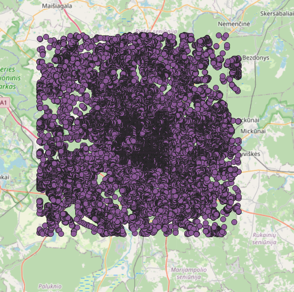
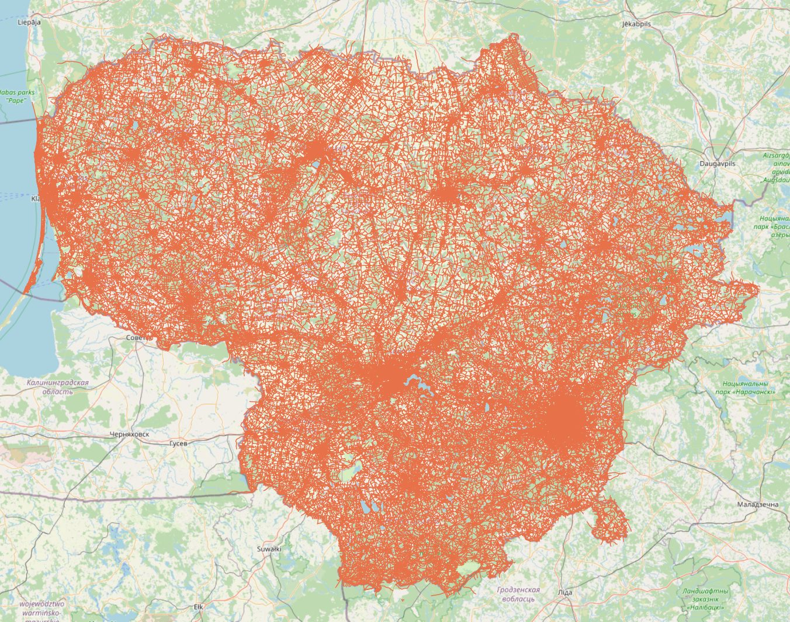

The Road Graph Tool is a Project for processing data from various sources into a road graph data usable as an input for transportation problems. Version 1.0.0 of the project targets to provide a road network with the following features:
- geographical location of vertices and edges,
- geographical shape of edges,
- elevation of vertices,
- measured and posted speed of edges, and
- travel demand data located at the vertices.

The version 1.0.0 of use the following data sources:
- OpenStreetMap (OSM) data for the road network and its geographical properties,
- SRTM data for the elevation of vertices,
- Uber Movement data for the speed of edges.
- Travel demand data from various sources.

The processing and storage of the data are done in a PostgreSQL/PostGIS database. To manipulate the database, import data to the database, and export data from the database, the project provides a set of Python scripts. 

# Quick Start Guide
To run the tool, you need access to a local or remote PostgreSQL database with the PostGIS extension installed. The remote database can be accessed through an SSH tunnel. The SSH tunneling is done on the application level, you just need to provide the necessary configuration in the `config.ini` file (see the [`config-EXAMPLE.ini`](./config-EXAMPLE.ini) file for an example configuration).

Currently, only parts of the tool are functional, so the database needs to be filled with the following data: TODO

The main runner script is `scripts/main.py`. 

To skip some processing steps, comment out the lines in the `main.py` file that are not needed.

Then, run the `main.py` script.

# Testing
For testing the PostgreSQL procedures that are the core of the tool, we use the `pgTAP` testing framework. To learn how to use `pgTAP`, see the [pgTAP manual](./doc/pgtap.md).


To run the tests, follow these steps:
1. Install the `pgTAP` extension in your PostgreSQL database according to the [pgTAP manual](./doc/pgtap.md).
2. Ensure all functions and procedures from the `SQL/` directory are present in your database.
3. Create a new schema named `test_env` if it doesn't already exist. This schema will serve as the testing environment. You can create it using the following SQL command:
```sql
CREATE SCHEMA IF NOT EXISTS test_env;
```
4. Execute the tests by running the following query in your PostgreSQL console:
```sql
   SELECT * FROM run_all_tests();
   ```

This query will return a result set containing the execution status of each test.

# Components
The road graph tool consists of a set of components that are responsible for individual processing steps, importing data, or exporting data. Each component is implemented as an PostgreSQL procedure, possibly calling other procedures or functions. Additionally, each component has its own Python wrapper script that connects to the database and calls the procedure. Currently, the following components are implemented:
- **OSM file processing for importing to PGSQL database**: processes data from OSM file that are to be imported into PostgreSQL database for further use
- **Graph Contraction**: simplifies the road graph by contracting nodes and creating edges between the contracted nodes.

## OSM file processing
### Prerequisities
Before we can process and load data (can be downloaded at [Geofabrik](https://download.geofabrik.de/)) into the database, we'll need to obtain and install several libraries: 
* psql (for PostgreSQL)
* osmium: osmium-tool (macOS `brew install osmium-tool`, Ubuntu `apt install osmium-tool`)
* osm2pgsql (macOS `brew install osm2pgsql`, Ubuntu (1.6.0 version) `apt install osm2pgsql`)
The PostgreSQL database needs PostGis extension in order to enable spatial and geographic capabilities within the database, which is essential for working with OSM data.
Loading large OSM files to database is memory demanding so [documentation](https://osm2pgsql.org/doc/manual.html#system-requirements) suggests to have at least as much RAM as the PBF file with the OSM data is large.

### 1. Preprocessing of OSM file (optional)
Preprocessing an OSM file with osmium aims to enhance importing efficiency and speed of osm2pgsql tool. The two most common actions are sorting and renumbering. For these actions, you can use the provided `process_osm.sh` script:
```bash
./process_osm.sh [action_tag] [input_file] -o [output_file]
```
Call `./process_osm.sh -h` or `./process_osm.sh --help` for more information.

#### Sorting:
Sorts objects based on IDs.
```bash
./process_osm.sh -s [input_file] -o [output_file]
```
#### Renumbering:
Negative IDs usually represent inofficial non-OSM data (no clashes with OSM data), osm2pgsql can only handle positive IDs (negative IDs are used internally for geometries).
Renumbering starts at index 1. 
```bash
./process_osm.sh -r [input_file] -o [output_file]
```

### 2. Importing to database using Flex output
The `process_osm.sh` script also allows to import OSM data to the database using [osm2pgsql](https://osm2pgsql.org) tool configured by [Flex output](https://osm2pgsql.org/doc/manual.html#the-flex-output). Flex output allows more flexible configuration such as filtering logic and creating additional types (e.g. areas, boundary, multipolygons) and tables for various POIs (e.g. restaurants, themeparks) to get the desired output. To use it, we specify the flex style file (Lua script) that has all the logic for processing data in OSM file.


The default style file for this project is `resources/lua_styles/default.lua`, that processes and all nodes, ways and relations with tags without creating additional attributes (columns).

```bash
./process_osm.sh -l [input_file] [style_file]
```

* E.g. this command (described bellow) processes osm file of Lithuania using Flex output and loads them into database (all configurations should be provided in `config.ini` in top folder).
```bash
# runs with default.lua
./process_osm.sh -l lithuania-latest.osm.pbf
# runs with highway.lua script
./process_osm.sh -l lithuania-latest.osm.pbf resources/lua_styles/highway.lua
```

**Nodes in Lithuania:**


### 3. Filtering and extraction
Data are often huge and lot of times we only need certain extracts or objects of interest in our database. So it's better practice to filter out only what we need and work with that in our database.

#### 3.1 Geographical extracts

#### 3.1.1 Box boundary extracts
Both osmium and osm2pgsql filter data inside the bounding box (bottom-left/minlon,minlat corner, top-right/maxlon,maxlat corner).

**Nodes inside bounding box in Lithuania:**


##### Osmium
- These commands process osm file using bounding box coordinates to filter data within the bounding box. File `resources/extracted-bbox.osm.pbf` is created and can be futher processed with Flex output.
```bash
# bounding box specified directly
./filter_osm.sh -bos [left],[bottom],[right],[top] [input_file] 
# bounding box specified in config file:
./filter_osm.sh -bos [config_file] [input_file]
```
- E.g. extract bounding box of Lithuania OSM file:
```bash
./filter_osm.sh -bos 25.12,54.57,25.43,54.75 lithuania-latest.osm.pbf
# or:
./filter_osm.sh -bos resources/extract-bbox.geojson lithuania-latest.osm.pbf
```

##### Flex output
- We can calculate the bounding box coordinates using `./filter_osm.sh -b` based on the ID of relation (mentioned in 3.1.2) that specifies the area of interest (e.g. Vilnius - capital of Lithuania). 
```bash
# find bbox (uses Python script find_bbox.py)
./filter_osm.sh -b [relation_id] [input_file] # output: minlon,minlat,maxlon,maxlan
```
- This command processes osm file using bounding box coordinates with Flex output.
```bash
osm2pgsql -d [dbname] -b minlon,minlat,maxlon,maxlan [input_file] 
```

- E.g. these commands find bounding box coordinates based on relation ID and extract data bounded by it from Lithuania OSM file:
```bash
./filter_osm.sh -b 1529146 lithuania-latest.osm.pbf # => 25.0245351,54.5689058,25.4814574,54.83232
osm2pgsql -d [dbname] -b 25.0245351,54.5689058,25.4814574,54.83232 --output=flex -S resources/lua_styles/default.lua lithuania-latest.osm.pbf
```

#### 3.1.2 Multipolygon/ID extracts (osmium)
For more precise extraction, we define multipolygon. Multipolygon can be defined in GeoJSON `extract-id.geojson` file from known specific relation ID - OSM multipolygon definition based on relation ID: https://www.openstreetmap.org/api/0.6/relation/RELATION-ID/full.

It's better to filter out only what we need with osmium (before processing with flex output) [as suggested](https://osm2pgsql.org/examples/road-length/).

**Ways inside multipolygon of Vilnius:**


##### Osmium
- ID can be found by specific filtering (or on OpenStreetMap) - e.g. to find relation ID that bounds Vilnius city (ID: 1529146), run:
```bash
# 1st filtration
osmium tags-filter r/type=boundary
# second filtration (-R tag to omit objects referenced by matched objects)
osmium tags-filter -R r/name:en=Vilnius
```
	- note: `admin_level=*` expression represents administrative level of feature (borders of territorial political entities) - each country (even county) can have different numbering
	- use `name:en` for easiest filtering
- get multipolygon (using `filter_osm.sh` script) extract that can be further processed with Flex output:
```bash
./filter_osm.sh -id [relation_id] [input_file]
# E.g. extract multipolygon based on relation ID of Vilnius city:
./filter_osm.sh -id 1529146 lithuania-latest.osm.pbf
./process_osm.sh -f extracted-multi.osm.pbf 
```
	- strategies: `-s [strategy]` to set strategy:
		- simple: faster, doesn't include complete ways (ways out of multipolygon)
		- complete ways: ways are reference-complete
		- smart: ways and multipolygon relations (by default) are reference-complete

#### 3.2 Filter tags
Filter specific objects based on tags.
- common tags: 
	- amenity, building, highway, leisure, natural, boundary
	- ([find more tags](https://wiki.openstreetmap.org/wiki/Main_Page))

**Ways with highway tag in Lithuania:**


#### 3.1.1 Osmium
<!-- https://osmcode.org/osmium-tool/manual.html#filtering-by-tags -->
- use `resources/expressions-example.txt`
```bash
osmium tags-filter [input_file] -e [expression_file] -o [output_file] 
# E.g. filters all nodes, ways and relations with tags specified in `expressions-example.txt
osmium tags-filter lithuania-latest.osm.pbf -e resources/expressions-example.txt -o osmium-highway.osm.pbf
```
- OR match - at least one match with specified expression
```bash
osmium tags-filter [input_file] [object_type]/[expression] -o [output_file]
# E.g. filters all nodes, ways and relations with tag of type highway
osmium tags-filter lithuania-latest.osm.pbf nwr/highway -o osmium-highway.osm.pbf
```
* `object_type`: n (nodes), w (ways), r (relations) - can be combined
* `expression`: what it should match against

#### 3.1.2 Flex output
- `resources/lua_styles/filter-highway.lua`:
	- filters nodes, ways and relations with highway tag
- E.g.
```bash
./process_osm.sh -f lithuania-latest.osm.pbf resources/lua_styles/filter-highway.lua
```

## Graph Contraction 
This script contracts the road graph within a specified area. 

- function: `contract_graph_in_area`
- SQL procedure: `contract_graph_in_area`
- location: `python/main.py`
- required tables:
    - `nodes`
    - `edges`
    - `road_segments`


### Processing details
The SQL procedure `contract_graph_in_area` processes the graph in the following steps, visualized in the diagram below:

1. **Road Segments Table Creation**: Generates a temporary table containing road segments within a target area. A road segment is a line between two subsequent nodes from the OSM data.
1. **Graph Contraction**: Contracts the graph by creating a temporary table that holds the contraction information for each node.
1. **Node Updates**: Updates the nodes in the database to mark some of them as contracted.
1. **Edge Creation**: Generates edges for both contracted and non-contracted road segments.
1. **Contraction Segments Generation**: Creates contraction segments to facilitate the creation of edges for contracted road segments.


