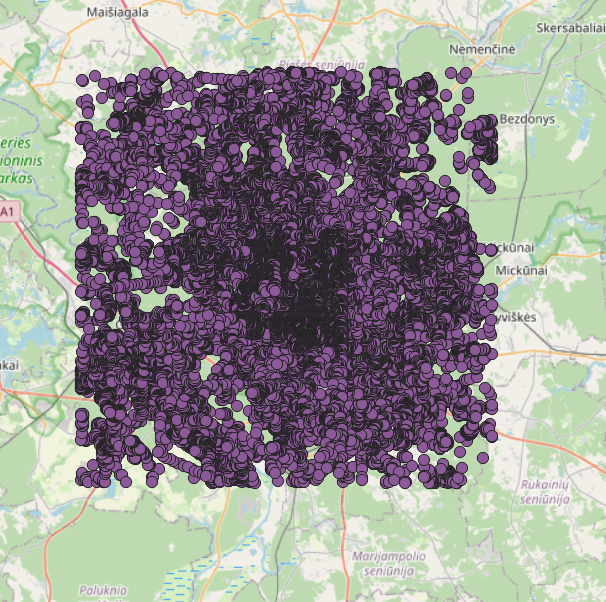
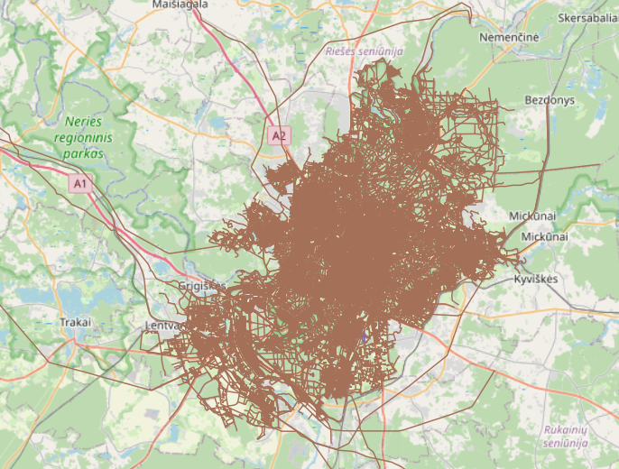
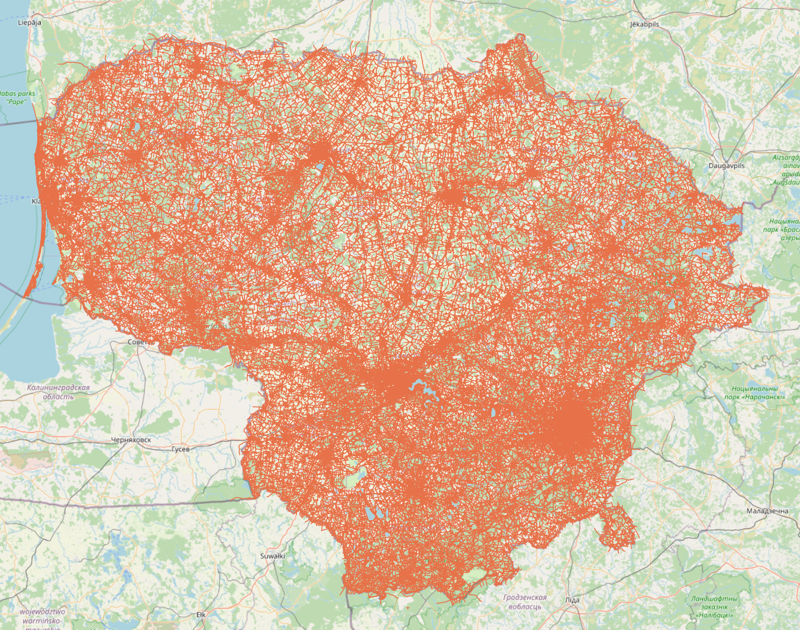

The Road Graph Tool is a project for processing data from various sources into a road graph usable as an input for transportation problems. Version 0.1.0 of the project targets to provide a road network with the following features:

- geographical location of vertices and edges, and
- geographical shape of edges

The version 0.1.0 use the following data sources:

- OpenStreetMap (OSM) data for the road network and its geographical properties,

The processing and storage of the data are done in a PostgreSQL/PostGIS database. To manipulate the database, import data to the database, and export data from the database, the project provides a set of Python scripts.


# Dependencies
To run the tool, you need access to a local or remote PostgreSQL database with the following extensions installed:

- [PostGIS](https://postgis.net/)
- [PgRouting](https://pgrouting.org/), and
- hstore (available by default).

Also, you need the [osm2pgsql](https://osm2pgsql.org/) tool installed for importing OSM data into the database.


# Quick Start Guide
To execute the configured pipeline, follow these steps:

1. Install the Road Graph Tool Python package: `pip install -e <clone dir>/Python`.
1. Create a YAML configuration file for the project. For details about this file, refer to the [Configuration](#configuration) section.
    1. Configure the database. The remote database can be accessed through an SSH tunnel. The SSH tunneling is handled at the application level.
1. In the `python/` directory, run the `scripts/install_sql.py`. This script will initialize the needed tables, procedures, functions, etc., in your database.
1. Run the `main.py` script with with the path to the configuration file as the first argument. The script will execute the pipeline according to the configuration file.


# Configuration
For configuring the Road Graph Tool, we use the [YAML](https://yaml.org/) format. The path to the configuration file should be specified as a first argument when running the main script.

All the relative paths specified in the configuration file are relative to the configuration file itself, unless specified otherwise.

The main configuration affecting the whole tool is in the root of the configuration file. Other parameters are in following sections:

- `db`: database configuration
- `road_import`: configuration for the road network import step (OSM file or Overpass)
- `export`: configuration for the export component
- `contraction`: configuration for the contraction component
- `strong_components`: configuration for the strong component which filters out the isolated vertices from the graph

Each component configuration has a property `activated` that activates the component if set to `true` and deactivates it if set to `false`.

In the root of the project, there is an example configuration file named `config-example.yml`.

## Database configuration

The database configuration is stored in the `db` section of the configuration file. The structure of the section is the following:

- `db_host`: the host of the database server.
- `db_port`: the port of the database server.
- `db_name`: the name of the database.
- `username`: the user of the database.
- `db_password`: the password of the database.

Additionally, it is possible to configure the SSH connection to the database server in the `ssh` section inside the `db` section. The structure of the section is the following:

- `ssh_server_address`: the address of the SSH server.
- `ssh_tunnel_local_port`: the port on the local machine where the SSH tunnel is established.
- `private_key_path`: the path to the private key file for the SSH connection.
- `server_username`: the username of the SSH server.

Typically, we do not want to store the secrets like private key path or database password in the configuration file so that we may share the configuration file with others. For that, we use a separate file for the secrets. 
The structure of the file is the same as the structure of the main configuration file and it is effectively merged with the main configuration file. To specify the path to the secrets file, use the `password_config_file` parameter in the root of the configuration file. The example file is stored in the root of the project and is named `secrets-example.yml`.


# Testing
For testing the PostgreSQL procedures that are the core of the Road Graph Tool, we use the [pgTAP testing framework](https://github.com/theory/pgtap). To learn how to use pgTAP, see the [pgTAP manual](https://f-i-d-o.github.io/Manuals/Programming/Database/PostgreSQL%20Manual/#testing-with-pgtap).


To run the tests, follow these steps:

1. Install the `pgTAP` extension for your PostgreSQL database cluster according to the [pgTAP manual](https://f-i-d-o.github.io/Manuals/Programming/Database/PostgreSQL%20Manual/#installation).
1. If you haven't already, create and initialize the database
1. Install the `pgTAP` extension in the database by running the following command in your PostgreSQL console:
    ```sql
    CREATE EXTENSION pgtap WITH SCHEMA public;
    ```
1. Execute the tests by running the following query in your PostgreSQL console:
    ```sql
    SELECT * FROM mob_group_runtests('*_.*');
    ```
    - This query will return a result set containing the execution status of each test.

To run just a selection of tests, use the following query:
```sql
SELECT * FROM mob_group_runtests('_insert_area_.*');
```
This query will run all tests that match the regular expression `_insert_area_.*`, and also the fixtures that match the same regular expression.


# Filtration of the input data
Because the map processing with Road Graph Tool can be time-consuming, it is recommended to filter the input data before processing. Most importantly, the data should be filtered to include

- only the area of interest, and
- only the objects of interest.

The following tools are available for filtering the input data:

- [Osmium](https://osmcode.org/osmium-tool/manual.html)
- [Osmfilter](https://wiki.openstreetmap.org/wiki/Osmfilter)


# Components
The Road Graph Tool consists of a set of components that are responsible for individual processing steps, importing data, or exporting data. Some components may be just python functions, but most of them are implemented as an PostgreSQL procedure and the Python is just a wrapper. 

Every component has its own section in the **configuration** file, containing the configuration for the component. The only key common to all components is `activated`, which is a boolean value that activates the component if set to `true` and deactivates it if set to `false`. The component is also deactivated if its section is not present in the configuration file.

Currently, the following components are implemented:

- **Area Insertion**: inserts an area into the database.
- **Road network import** (`road_import`): loads the road graph from either an OSM file (via osm2pgsql) or the Overpass API. Exactly one backend is selected with `road_import.source.type` (`osm_file` or `overpass`); they are not run in sequence.
- **Graph Contraction**: simplifies the road graph by contracting nodes and creating edges between the contracted nodes.
- **Strong Components**: computes the strong components of the road graph.
- **Export**: exports the road graph to a file.
- **Distance Matrix Generator**: generates a distance matrix for the road graph.

Each component is described in more detail in the following sections.


## Area Insertion
key: `area_insert`

The area insertion component inserts an area boundary into the database (table `areas`). There are two ways to specify the area boundary (specified by `boundary_source.type`):

- `overpass`: the area boundary is specified by configuration parameters and downloaded from the Overpass API.
- `geojson_file`: the area boundary is specified by a GeoJSON file.

The hared configuration parameters for both types are:

- `description`: the description of the area.
- `allow_multipolygon` (boolean, default: `false`): whether to allow multipolygon area boundary. If we expect the area boundary to be a single polygon, leave it to `false`.


### Overpass Area Boundary
To get the area boundary from the Overpass API, the `boundary_source` must contain the `admin_boundary_name` parameter. Additionally, we may want to specify the enclosing areas to avoid getting unrelated areas with coinciding names:

- `admin_boundary_name` (required): the name of the admin boundary.
- `enclosing_areas` (array of strings): the names of the enclosing areas of the boundary we want to import. If multiple enclosing areas are specified, they are applied in order of the array, so you should specify them from the outermost to the innermost. 
    - Example: `enclosing_areas: ["US", "New York"]`


## Road network import
key: `road_import`

This component loads road network geometry into the database. It has two modes, selected by `road_import.source.type`:

- `overpass`: import from the Overpass API. Simple configuration, but not suitable for large areas.
- `osm_file`: import from a local OSM / PBF file using `osm2pgsql`. This mode can handle large areas, but has some prerequisites


### Source type `overpass`
The query uses the polygon geometry of the existing `areas` row for the current `area_id`. 


### Source type `osm_file`
- `input_file` (required): path to the OSM / PBF file (relative paths are resolved from the config file directory).
- `style_file`: built-in style name (e.g. `pipeline`) or path to a `.lua` flex style.
- `force` (boolean): allow re-import into non-empty staging tables.
- `pgpass` / `pgpass_file`: authentication for `osm2pgsql`.

When an `area_id` is already known (from root `area_id`, a previous pipeline step, or `area_insert`), the importer uses the **bounding box** of that area’s polygon from `"<schema>.areas"` to clip the OSM import (`osm2pgsql -b`). If there is **no** `area_id`, a new area row is created from imported data.

#### Prerequisities
Before using the `osm_file` mode, we need to install several tools: 

- `psql` executable (part of the [PostgreSQL](https://www.postgresql.org/) distribution) 
- [osmium](https://osmcode.org/): for preprocessing of OSM files
    - on Unix systems the package is named `osmium-tool`
- [osm2pgsql](https://osm2pgsql.org/) for importing 
    - the current version of RGT is compatible with both `2.0.0` and `1.11.0` version of `osm2pgsql`.
    - Loading large OSM files to database is memory demanding so [documentation](https://osm2pgsql.org/doc/manual.html#system-requirements) suggests to have RAM of at least the size of the OSM file.

#### Preprocessing of OSM file
Working with large OSM files can be slow and inefficient. To enhance importing efficiency we recoomand to first use the `filter_osm.py` and `process_osm.py` scripts to preprocess the OSM file. These scripts use `osmium` to:

- `filter_osm.py`: filter the OSM file based on the given criteria
- `process_osm.py`: sort and renumber the objects in the OSM file

Both `filter_osm.py` and `process_osm.py` output some basic logging info. Use `-v/--verbose` for more debugging.


##### `filter_osm.py`
This script filters the OSM file based on the given criteria. The syntax is:
```bash
python3 filter_osm.py <option> <input_file> <arguments>
```

Available options:

- `b`: filter by bounding box. 
    - You mus supply the `c` flag followed by the bounding box coordinates: `filter_osm.py b <input_file> -c <bbox specification>`. 
    - Two formats are supported for the bounding box specification:
        - `<minimum longitude>,<minimum latitude>,<maximum longitude>,<maximum latitude>`
        - path tho the `geojson` file containing the bounding box coordinates
    - Example calls:
        ```bash
        python3 filter_osm.py b lithuania-latest.osm.pbf -c 25.12,54.57,25.43,54.75
        # or:
        python3 filter_osm.py b lithuania-latest.osm.pbf -c resources/extract-bbox.geojson
        ```
    - Example result:
        <div></div>
- `id`: filter by boundary defined by boundary relation id. Call as `filter_osm.py id <input_file> -rid <relation_id> [-s <strategy>]`.
    - Strategies (optional for `id` and `b` flags in `filter_osm.py`) are used to extract region in certain way: 
        - simple: faster, doesn't include complete ways (ways out of multipolygon)
        - complete ways: ways are reference-complete
        - smart: ways and multipolygon relations (by default) are reference-complete
    - Example call:
        ```bash
        python3 filter_osm.py id lithuania-latest.osm.pbf -rid 1529146 # creates: id_extract.osm
        ```
    - Example result:
        <div></div>
- `t`: filter by tags. Call as `filter_osm.py t <input_file> -e <expression_file> [-R]`.
    - The `expression_file` can contain either:
        - `[object_type]/[expression]` where:
            - `object_type`: n (nodes), w (ways), r (relations) - can be combined
            - `expression`: what it should match against
        - [more details](https://docs.osmcode.org/osmium/latest/osmium-tags-filter.html)
    - if the optional `-R` flag is used, nodes referenced in ways and members referenced in relations will not be added to output
    - Example call:
        ```bash
        python3 filter_osm.py t lithuania-latest.osm.pbf -e resources/expressions-example.txt # creates: t_extract.osm
        ```
    - Example result:
        <div></div>


##### `process_osm.py`
This script sorts and renumbers the objects in the OSM file. Usage:
```bash
python3 process_osm.py [option_flags] [input_file] -o [output_file]
```

Available options:

- `s`: **sorts** objects based on IDs in ascending order.
- `r`: **renumbers** objects based on IDs in ascending order. Negative IDs usually represent inofficial non-OSM data (no clashes with OSM data), osm2pgsql can only handle positive sorted IDs (negative IDs are used internally for geometries).
Renumbering starts at index 1 and goes in ascending order.

Call `python3 process_osm.py -h` or `python3 process_osm.py --help` for more information.

#### Importing to database using Flex output
The `osm_file` mode uses the`osm2pgsql` tool configured by [Flex output](https://osm2pgsql.org/doc/manual.html#the-flex-output). Flex output allows more flexible configuration such as filtering logic and creating additional types (e.g. areas, boundary, multipolygons) and tables for various POIs (e.g. restaurants, themeparks) to get the desired output. To use it, we define the Flex style file (Lua script) that has all the logic for processing data in OSM file.


## Graph Contraction 
This script contracts the road graph within a specified area. 

- function: `contract_graph_in_area`
- SQL procedure: `contract_graph_in_area`
- location: `python/main.py`
- required tables:
    - `nodes`
    - `edges`
    - `road_segments`


### Processing details
The SQL procedure `contract_graph_in_area` processes the graph in the following steps, visualized in the diagram below:

1. **Road Segments Table Creation**: Generates a temporary table containing road segments within a target area. A road segment is a line between two subsequent nodes from the OSM data.
1. **Graph Contraction**: Contracts the graph by creating a temporary table that holds the contraction information for each node.
1. **Node Updates**: Updates the nodes in the database to mark some of them as contracted.
1. **Edge Creation**: Generates edges for both contracted and non-contracted road segments.
1. **Contraction Segments Generation**: Creates contraction segments to facilitate the creation of edges for contracted road segments.


<!--  -->

## Exporter
The exporter component is responsible for exporting the processed data from the database. Currently, the following formats are supported:

- **CSV**: exports the data to two CSV files: one for nodes and one for edges. The columns are separated by a tabulator.
- **Shapefile**: exports the data to two [shapefiles](https://en.wikipedia.org/wiki/Shapefile): one for nodes and one for edges.

The output files contain the following fields:

The **nodes** file contains

- `id`: the unique identifier of the node. The id goes from 0 to the number of exported nodes - 1, so it can be used as an index.
- `db_id`: the unique identifier of the node in the database.
- `x`: the x-coordinate of the node.
- `y`: the y-coordinate of the node.

The **edges** file contains:

- `u`: the `id` of the starting node of the edge.
- `v`: the `id` of the ending node of the edge.
- `db_id_from`: the unique identifier of the starting node in the database.
- `db_id_to`: the unique identifier of the ending node in the database.
- `length`: the length of the edge in meters.
- `speed`: the speed on the edge in km/h.


# Development Guide

## PostgreSQL Tests
For testing the PostgreSQL, we use the [pgTAP](https://pgtap.org/) framework. You can find more information about the framework in the [pgTAP manual](https://f-i-d-o.github.io/Manuals/Programming/Database/PostgreSQL%20Manual).


### Custom test executer
Because pgTAP provides only a basic function for executing tests, that for example, executes every single fixture even if a test filter is used, we created a custom test executer `mob_group_runtests` that can be used to run tests. The source code for this execution machinery can be found in the `SQL/tests/test_extensions.sql` file. The main difference compared to the default test runner:

- filter is applied to the test fixtures as well, not only to the tests
- tests are executed in a separate schema (`test_env` by default)


### Creating new tests
To create a new test, just create a test function in the appropriate test file in the `tests` directory. Tests have to be named `test_<function_name>_<test_description>`.

You can also create [*fixtures*](https://f-i-d-o.github.io/Manuals/Programming/Database/PostgreSQL%20Manual/#fixtures). To be compatible with the custom test executer you have to follow the naming convention `<fixture_type>_<function_name>_<test_description>`. Note that unlike other programming languages, here all fixtures of a certain type are executed at once, not just the onec with the name that matches the test name.

If you need to crete a test for a function or procedure that is not covered by the existing test files, create a new test file in the `tests` directory. The test file should be named `test_<function_name>.sql`.
