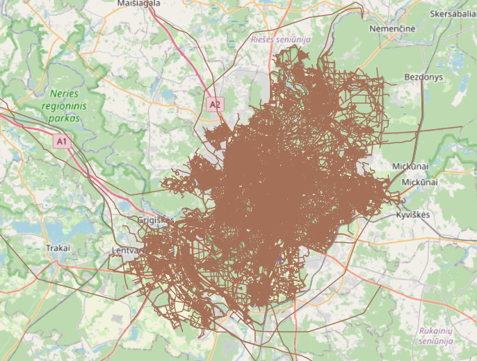

The Road Graph Tool is a Project for processing data from various sources into a road graph data usable as an input for transportation problems. Version 1.0.0 of the project targets to provide a road network with the following features:
- geographical location of vertices and edges,
- geographical shape of edges,
- elevation of vertices,
- measured and posted speed of edges, and
- travel demand data located at the vertices.

The version 1.0.0 of use the following data sources:
- OpenStreetMap (OSM) data for the road network and its geographical properties,
- SRTM data for the elevation of vertices,
- Uber Movement data for the speed of edges.
- Travel demand data from various sources.

The processing and storage of the data are done in a PostgreSQL/PostGIS database. To manipulate the database, import data to the database, and export data from the database, the project provides a set of Python scripts. 

# Quick Start Guide
To run the tool, you need access to a local or remote PostgreSQL database with the PostGIS extension installed. The remote database can be accessed through an SSH tunnel. The SSH tunneling is done on the application level, you just need to provide the necessary configuration in the `config.ini` file (see the [`config-EXAMPLE.ini`](./config-EXAMPLE.ini) file for an example configuration).

Currently, only parts of the tool are functional, so the database needs to be filled with the following data: TODO

The main runner script is `scripts/main.py`. 

To skip some processing steps, comment out the lines in the `main.py` file that are not needed.

Then, run the `main.py` script.
- If you want to import OSM file to the database (details specified in `config.ini`), run the script with additional tag: `main.py -i` or `main.py --import`. It expects the OSM file to be `resources/to_import.*` where * is one of the following extensions: osm, osm.pbf, osm.bz2. It also uses [`default.lua`](resources/lua_styles/default.lua) as its default style file.


# Testing
For testing the PostgreSQL procedures that are the core of the Road Graph Tool, we use the [pgTAP testing framework](https://github.com/theory/pgtap). To learn how to use pgTAP, see the [pgTAP manual](./doc/pgtap.md).


To run the tests, follow these steps:
1. Install the `pgTAP` extension for your PostgreSQL database cluster according to the [pgTAP manual](./doc/pgtap.md).
1. If you haven't already, create and initialize the database
    1. create new database using `CREATE DATABASE <database_name>;`
    1. copy the `config-EXAMPLE.ini` file to `config.ini` and fill in the necessary information
    1. inititalize new database using the script `<rgt root>/python/scripts/install_db.py`. 
        - this script will install all necessary extensions and create all necessary tables, procedures, and functions.
        - the configuration for the database is loaded from the `config.ini` file.
4. Execute the tests by running the following query in your PostgreSQL console:
    ```sql
    SELECT * FROM run_all_tests();
    ```
    - This query will return a result set containing the execution status of each test.

# Components
The road graph tool consists of a set of components that are responsible for individual processing steps, importing data, or exporting data. Each component is implemented as an PostgreSQL procedure, possibly calling other procedures or functions. Additionally, each component has its own Python wrapper script that connects to the database and calls the procedure. Currently, the following components are implemented:
- **OSM file processing for importing to PGSQL database**: processes data from OSM file that are to be imported into PostgreSQL database for further use
- **Graph Contraction**: simplifies the road graph by contracting nodes and creating edges between the contracted nodes.

## OSM file processing
### Prerequisities
Before we can process and load data (can be downloaded at [Geofabrik](https://download.geofabrik.de/)) into the database, we'll need to obtain and install several libraries: 
* psql (for PostgreSQL)
* osmium: osmium-tool (macOS `brew install osmium-tool`, Ubuntu `apt install osmium-tool`)
* osm2pgsql (macOS `brew install osm2pgsql`, Ubuntu (1.6.0 version) `apt install osm2pgsql`)
The PostgreSQL database needs PostGis extension in order to enable spatial and geographic capabilities within the database, which is essential for working with OSM data.
Loading large OSM files to database is memory demanding so [documentation](https://osm2pgsql.org/doc/manual.html#system-requirements) suggests to have RAM of at least the size of the OSM file.

### 1. Preprocessing of OSM file (optional)
Preprocessing an OSM file with osmium aims to enhance importing efficiency and speed of osm2pgsql tool. The two most common actions are sorting and renumbering. For these actions, you can use the provided `process_osm.py` Python script:
```bash
python3 process_osm.py [action_tag] [input_file] -o [output_file]
```
Call `python3 process_osm.py -h` or `python3 process_osm.py --help` for more information.

- Sorting: Sorts objects based on IDs in ascending order.
```bash
python3 process_osm.py s [input_file] -o [output_file]
```
- Renumbering: Negative IDs usually represent inofficial non-OSM data (no clashes with OSM data), osm2pgsql can only handle positive sorted IDs (negative IDs are used internally for geometries).
Renumbering starts at index 1 and goes in ascending order.
```bash
python3 process_osm.py s [input_file] -o [output_file]
```
- Sorting and renumbering: Sorts and renumbers IDs in ascending order starting from index 1.
```bash
python3 process_osm.py sr [input_file] -o [output_file]
```

### 2. Importing to database using Flex output
The `process_osm.py` script also allows to import OSM data to the database using [osm2pgsql](https://osm2pgsql.org) tool configured by [Flex output](https://osm2pgsql.org/doc/manual.html#the-flex-output). Flex output allows more flexible configuration such as filtering logic and creating additional types (e.g. areas, boundary, multipolygons) and tables for various POIs (e.g. restaurants, themeparks) to get the desired output. To use it, we specify the Flex style file (Lua script) that has all the logic for processing data in OSM file.

The default style file for this project is `resources/lua_styles/default.lua`, which processes and all nodes, ways and relations without creating additional attributes (based on tags) into following tables: `nodes` (node_id, geom, tags), `ways` (way_id, geom, tags, nodes), `relations` (relation_id, tags, members).

```bash
python3 process_osm.py u [input_file] [-l style_file]
```

* E.g. this command (described bellow) processes OSM file of Lithuania using Flex output and uploads it into database (all configurations should be provided in `config.ini` in top folder).
```bash
# runs with default.lua
python3 process_osm.py u lithuania-latest.osm.pbf
# runs with highway.lua script
python3 process_osm.py u lithuania-latest.osm.pbf -l resources/lua_styles/highway.lua
```

**Nodes in Lithuania:**


It should be noted that `process_osm.py u` and `process_osm.py b` both run osm2pgsql with `-x` tag (extra attributes) which adds OSM attributes such as version, timestamp, uid, etc. to the OSM objects processed in osm2pgsql since normally objects without tags would not be processed.

### 3. Filtering and extraction
Data are often huge and lot of times we only need certain extracts or objects of interest in our database. So it's better practice to filter out only what we need and work with that in our database.

#### 3.1 Geographical extracts

#### 3.1.1 Box boundary extracts
Both osmium and osm2pgsql filter data inside the bounding box of following format: `bottom-left (minlon,minlat) corner, top-right (maxlon,maxlat) corner`.

**Nodes inside bounding box in Lithuania:**


##### Osmium
- These commands process OSM file using bounding box coordinates to filter data within the bounding box. File `resources/extracted-bbox.osm.pbf` is created and can be futher processed with Flex output.
```bash
# bounding box specified directly
python3 filter_osm.py b [input_file] -c [left],[bottom],[right],[top]
# bounding box specified in config file:
python3 filter_osm.py b [input_file] -c [config_file]
```
- E.g. extract bounding box of Lithuania OSM file:
```bash
python3 filter_osm.py b lithuania-latest.osm.pbf -c 25.12,54.57,25.43,54.75
# or:
python3 filter_osm.py b lithuania-latest.osm.pbf -c resources/extract-bbox.geojson
```

##### Flex output
- We can calculate the greatest bounding box coordinates using `python3 process_osm.py b` based on the ID of relation (mentioned in [3.1.2](#3.1.2-multipolygon/id-extracts-(osmium))) that specifies the area of interest (e.g. Vilnius - capital of Lithuania). This command processes OSM file using calculated bounding box coordinates with Flex output and imports the bounded data into database.
```bash
# find bbox (uses Python script find_bbox.py)
python3 process_osm.py b [input_file] -id [relation_id] -s [style_file]
```

- E.g. this command extracts greatest bounding box from given relation ID of Lithuania OSM file and uploads it to PostgreSQL database using osm2pgsql:
```bash
python3 process_osm.py b lithuania-latest.osm.pbf -id 1529146
```

#### 3.1.2 Multipolygon/ID extracts (osmium)
For more precise extraction, we define multipolygon. Multipolygon can be defined in GeoJSON `extract-id.geojson` file from known specific relation ID - OSM multipolygon definition based on relation ID: https://www.openstreetmap.org/api/0.6/relation/RELATION-ID/full.

It's better to filter out only what we need with osmium (before processing with flex output) [as suggested](https://osm2pgsql.org/examples/road-length/).

**Ways inside multipolygon of Vilnius:**



##### Osmium
- ID can be found by specific filtering using `resources/expression-example.txt` or on OpenStreetMap - [more on how to filter](#3.2-filter-tags)
    - note: `admin_level=*` expression represents administrative level of feature (borders of territorial political entities) - each country (even county) can have different numbering
    - use `name:en` for easiest filtering
- e.g. to find relation ID that bounds Vilnius city (ID: 1529146), run double [tag filtration](#3.2-filter-tags):
```bash
# expressions-example.txt should contain: r/type=boundary
python3 filter_osm.py f lithuania-latest.osm.pbf -e expressions-example.txt
# expressions-example.txt should contain: r/name:en=Vilnius
python3 filter_osm.py f lithuania-latest.osm.pbf -e expressions-example.txt
```
- get multipolygon extract that can be further processed with Flex output:
```bash
python3 filter_osm.py id [input_file] -rid [relation_id] [-s strategy] 
# E.g. extract multipolygon based on relation ID of Vilnius city:
python3 filter_osm.py id lithuania-latest.osm.pbf -rid 1529146 # creates: id_extract.osm
python3 process_osm.py u id_extract.osm
```
- Strategies (optional for `id` and `b` tags in `filter_osm.py`) are used to extract region in certain way: use `[-s strategy]`to set strategy:
    - simple: faster, doesn't include complete ways (ways out of multipolygon)
    - complete ways: ways are reference-complete
    - smart: ways and multipolygon relations (by default) are reference-complete

#### 3.2 Filter tags
Filter specific objects based on tags.
- common tags: 
	- amenity, building, highway, leisure, natural, boundary
	- [find more tags here](https://wiki.openstreetmap.org/wiki/Main_Page)

**Ways with highway tag in Lithuania:**


#### 3.2.1 Osmium
<!-- https://osmcode.org/osmium-tool/manual.html#filtering-by-tags -->
* use `resources/expressions-example.txt` to specify tags to be filtered in format: `[object_type]/[expression]` where:
    * `object_type`: n (nodes), w (ways), r (relations) - can be combined
    * `expression`: what it should match against
```bash
python3 filter_osm.py t [input_file] -e [expression_file] [-R]
```
- Optional `-R` tag: nodes referenced in ways and members referenced in relations will not be added to output if `-R` tag is used
#### 3.2.2 Flex output
- Use lua style files to filter out desired objects.
    - e.g.`resources/lua_styles/filter-highway.lua` filters nodes, ways and relations with highway tag
```bash
python3 process_osm.py u lithuania-latest.osm.pbf -s resources/lua_styles/filter-highway.lua
```
- More examples of various Flex configurations can be found in oficial [osm2pgsql GitHub project](https://github.com/osm2pgsql-dev/osm2pgsql/tree/master/flex-config).

## Graph Contraction 
This script contracts the road graph within a specified area. 

- function: `contract_graph_in_area`
- SQL procedure: `contract_graph_in_area`
- location: `python/main.py`
- required tables:
    - `nodes`
    - `edges`
    - `road_segments`


### Processing details
The SQL procedure `contract_graph_in_area` processes the graph in the following steps, visualized in the diagram below:

1. **Road Segments Table Creation**: Generates a temporary table containing road segments within a target area. A road segment is a line between two subsequent nodes from the OSM data.
1. **Graph Contraction**: Contracts the graph by creating a temporary table that holds the contraction information for each node.
1. **Node Updates**: Updates the nodes in the database to mark some of them as contracted.
1. **Edge Creation**: Generates edges for both contracted and non-contracted road segments.
1. **Contraction Segments Generation**: Creates contraction segments to facilitate the creation of edges for contracted road segments.


