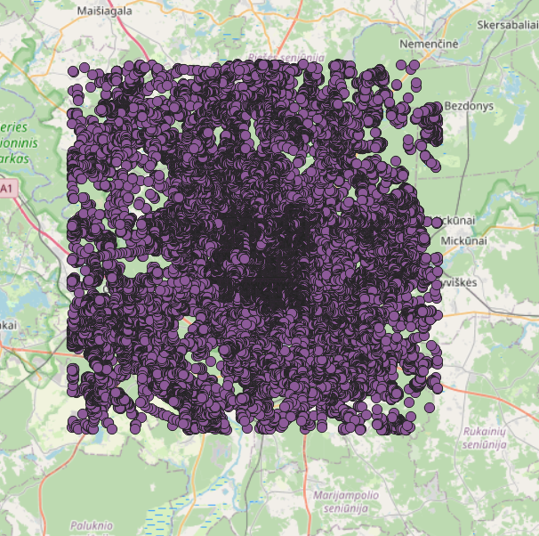
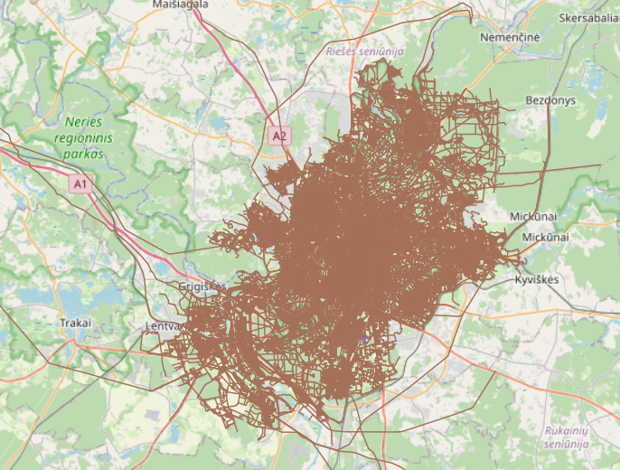
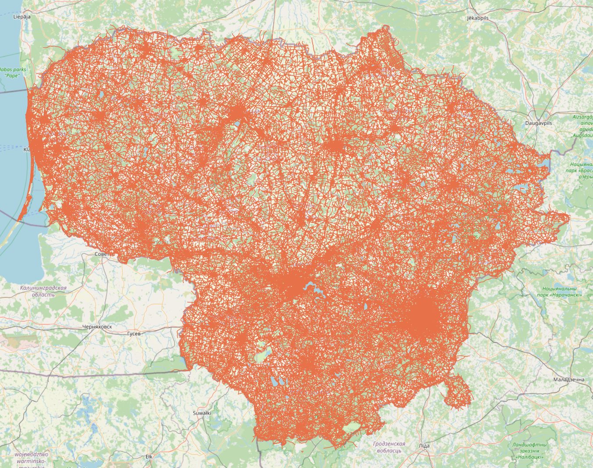

# Processing OSM file for importing to PGSQL database

* Author: Dominika Sidlova
* Last update: 12.03.2024

## Description
This directory contains scripts for processing OSM file that is to be imported into PostgreSQL database along with config file for the flex output.

## Prerequisities
To process data and load them into database, we need to download a few libraries: 
* psql (for postgresql)
* osmium: osmium-tool (on MACOS `brew install osmium-tool`), libosmium (on MACOS `brew install libosmium`)
* osm2pgsql (on MACOS `brew install osm2pgsql`)

## 1. Preprocessing of OSM file (optional)
Preprocessing an OSM file with osmium aims to enhance importing efficiency and speed of osm2pgsql tool. The two most common actions are sorting and renumbering. For these actions, you can use the provided `process` script:
```bash
./process.sh [action_tag] [input_file] -o [output_file]
```
Call `./process.sh -help` for more information.

### Sorting:
Sorts objects based on IDs.
```bash
./process.sh -s [input_file] -o [output_file]
```
### Renumbering:
Negative IDs usually represent inofficial non-OSM data (no clashes with OSM data), osm2pgsql can only handle positive IDs (negative IDs are used internally for geometries).
Renumbering starts at index 1. 
```bash
./process.sh -r [input_file] -o [output_file]
```

## 2. Importing to database using Flex output
We use [osm2pgsql](https://osm2pgsql.org) tool configured by [Flex output](https://osm2pgsql.org/doc/manual.html#the-flex-output) to import OSM data to the database. Flex output allows more flexible configuration to get the desired output. To use it, we specify the flex style file (Lua script) that has all the logic for processing data in OSM file.

The default style file for this project is `styles/default.lua`, that processes and all nodes, ways and relations with tags without creating additional attributes (columns).

* E.g. this command (described bellow) processes osm file of Lithuania using Flex output and imports them into database `dbname`.
```bash
osm2pgsql -d dbname --output=flex -S styles/default.lua lithuania-latest.osm.pbf
```

**Nodes in Lithuania:**


Flex style file can be used for more complex filtering logic and creating additional types (e.g. areas, boundary, multipolygons) and tables for various POIs (e.g. restaurants, themeparks).

### Import data using style script:
```bash
# without extra attributes
osm2pgsql -d [dbname] --output=flex -S [style_file] [input_file]
# `-x` for extra attributes (e.g. version, timestamp of objects)
osm2pgsql -d [dbname] --output=flex -x -S [style_file] [input_file]
```

## 3. Filtering and extraction
Data are often huge and lot of times we only need certain extracts or objects of interest in our database. So it's better practice to filter out only what we need and work with that in our database.

### 3.1 Geographical extracts

### 3.1.1 Box boundary extracts
Both osmium and osm2pgsql filter data inside the bounding box (bottom-left/minlon,minlat corner, top-right/maxlon,maxlat corner).

**Nodes inside bounding box in Lithuania:**


#### Osmium
- These commands process osm file using bounding box coordinates to filter data within the bounding box. File `extracted-bbox.osm.pbf` is created and can be futher processed with Flex output.
```bash
# bounding box specified directly
./filter.sh -bos [left],[bottom],[right],[top] [input_file] 
# bounding box specified in config file:
./filter.sh -bos [config_file] [input_file]
```
- E.g. extract bounding box of Lithuania OSM file:
```bash
./filter.sh -bos 25.12,54.57,25.43,54.75 lithuania-latest.osm.pbf
# or:
./filter.sh -bos extract/extract-bbox.geojson lithuania-latest.osm.pbf
```

#### Flex output
- We can calculate the bounding box coordinates using `./filter.sh -b` based on the ID of relation (mentioned in 3.1.2) that specifies the area of interest (e.g. Vilnius - capital of Lithuania). 
```bash
# find bbox (uses python script)
./filter.sh -b [relation_id] [input_file] # output: minlon,minlat,maxlon,maxlan
```
- This command processes osm file using bounding box coordinates with Flex output.
```bash
osm2pgsql -d [dbname] -b minlon,minlat,maxlon,maxlan [input_file] 
```

- E.g. these commands find bounding box coordinates based on relation ID and extract data bounded by it from Lithuania OSM file:
```bash
./filter.sh -b 1529146 lithuania-latest.osm.pbf # => 25.0245351,54.5689058,25.4814574,54.83232
osm2pgsql -d [dbname] -b 25.0245351,54.5689058,25.4814574,54.83232 --output=flex -S styles/default.lua lithuania-latest.osm.pbf
```

### 3.1.2 Multipolygon/ID extracts (osmium)
For more precise extraction, we define multipolygon. Multipolygon can be defined in GeoJSON `extract-id.geojson` file from known specific relation ID - OSM multipolygon definition based on relation ID: https://www.openstreetmap.org/api/0.6/relation/RELATION-ID/full.

It's better to filter out only what we need with osmium (before processing with flex output) [as suggested](https://osm2pgsql.org/examples/road-length/).

**Ways inside multipolygon of Vilnius:**


#### Osmium
- ID can be found by specific filtering (or on OpenStreetMap) - e.g. to find relation ID that bounds Vilnius city (ID: 1529146), run:
```bash
# 1st filtration
osmium tags-filter r/type=boundary
# second filtration (-R tag to omit objects referenced by matched objects)
osmium tags-filter -R r/name:en=Vilnius
```
	- note: `admin_level=*` expression represents administrative level of feature (borders of territorial political entities) - each country (even county) can have different numbering
	- use `name:en` for easiest filtering
- get multipolygon (using `filter.sh` script) extract that can be further processed with Flex output:
```bash
./filter.sh -id [relation_id] [input_file]
# E.g. extract multipolygon based on relation ID of Vilnius city:
./filter.sh -id 1529146 lithuania-latest.osm.pbf
osm2pgsql -d [dbname] --output=flex -S styles/default.lua extracted-multi.osm.pbf
```
	- strategies: `-s [strategy]` to set strategy:
		- simple: faster, doesn't include complete ways (ways out of multipolygon)
		- complete ways: ways are reference-complete
		- smart: ways and multipolygon relations (by default) are reference-complete

### 3.2 Filter tags
Filter specific objects based on tags.
- common tags: 
	- amenity, building, highway, leisure, natural, boundary
	- ([find more tags](https://wiki.openstreetmap.org/wiki/Main_Page))

**Ways with highway tag in Lithuania:**


### 3.1.1 Osmium
<!-- https://osmcode.org/osmium-tool/manual.html#filtering-by-tags -->
- use `filter/expressions-example.txt`
```bash
osmium tags-filter [input_file] -e [expression_file] -o [output_file] 
# E.g. filters all nodes, ways and relations with tags specified in `expressions-example.txt
osmium tags-filter lithuania-latest.osm.pbf -e filter/expressions-example.txt -o osmium-highway.osm.pbf
```
- OR match - at least one match with specified expression
```bash
osmium tags-filter [input_file] [object_type]/[expression] -o [output_file]
# E.g. filters all nodes, ways and relations with tag of type highway
osmium tags-filter lithuania-latest.osm.pbf nwr/highway -o osmium-highway.osm.pbf
```
* `object_type`: n (nodes), w (ways), r (relations) - can be combined
* `expression`: what it should match against

### 3.1.2 Flex output
- `styles/filter-highway.lua`:
	- filters highway nodes, ways and relations

- E.g.
```bash
osm2pgsql -d dbname --output=flex -S styles/filter-highway.lua lithuania-latest.osm.pbf
```
